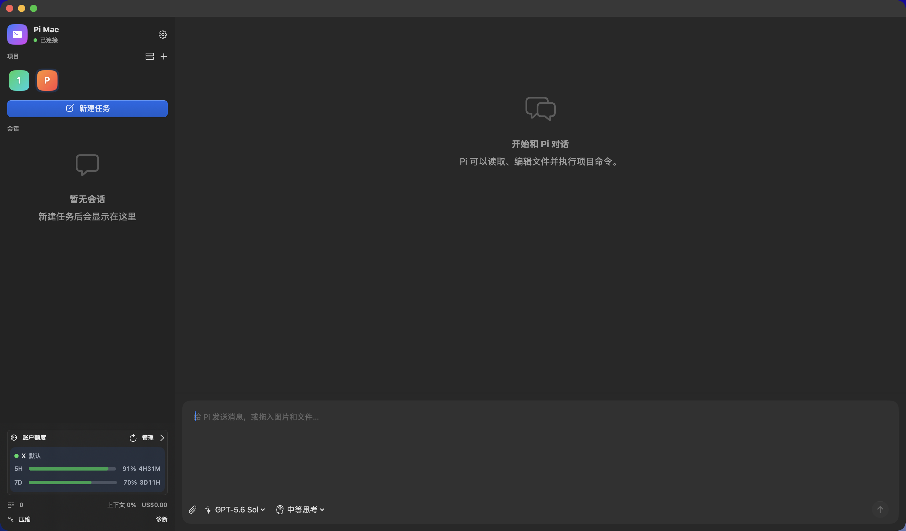

# Pi Mac

**English** | [简体中文](README.zh-CN.md)

[](https://github.com/TianYa-Q/PiMac/actions/workflows/release.yml)
[](https://github.com/TianYa-Q/PiMac/releases/latest)
[](https://github.com/TianYa-Q/PiMac)
[](LICENSE)

A native macOS [Pi coding agent](https://github.com/badlogic/pi-mono) client built with SwiftUI. Rather than emulating a terminal, Pi Mac manages real agent sessions through Pi's official JSONL RPC protocol and continues to use your existing Pi configuration.



## Features

- Add and switch between multiple projects in one window, with separate sessions and background tasks
- Stream responses, reasoning, and tool calls
- Send messages, re-edit previous prompts, steer after tool calls, follow up after completion, and remove queued messages that have not been consumed
- Attach images and files by dragging, selecting, or pasting, and send image content over RPC
- Switch models and thinking levels
- Check Pi and extension package versions in Settings, then install available updates with one click
- Run multiple sessions concurrently in independent background RPC processes
- Create, name, and open persistent sessions, and automatically restore the most recent session after relaunching
- View compaction, token, cost, and context usage statistics
- Support select, confirm, input, and editor dialogs provided by Pi extensions
- Manage multiple Codex accounts and display Codex/Gemini quotas with [account-usage](https://github.com/TianYa-Q/account-usage)
- Reuse existing authentication, models, skills, extensions, and settings from `~/.pi/agent`

## Download and Installation

1. Download the latest `Pi-Mac-vX.Y.Z.zip` from [GitHub Releases](https://github.com/TianYa-Q/PiMac/releases/latest).
2. Extract the archive and move **Pi Mac.app** to your Applications folder.
3. Make sure Pi is installed and you are signed in.
4. To enable account management and quota display, install the `account-usage` extension before launching Pi Mac:

   ```bash
   pi install git:github.com/TianYa-Q/account-usage@v1.0.0
   ```

> Current releases use ad-hoc signing and are not notarized by Apple. If macOS blocks the app the first time, right-click it in Finder and choose **Open**, or allow it under **System Settings → Privacy & Security**.

## Requirements

- macOS 14 or later
- [Pi coding agent](https://github.com/badlogic/pi-mono/tree/main/packages/coding-agent), installed and authenticated

Pi Mac searches for the Pi executable in this order by default:

1. `~/Library/pnpm/bin/pi`
2. `/opt/homebrew/bin/pi`
3. `/usr/local/bin/pi`

You can also select another path in the app's settings. Pi is launched through a login shell so paths for Node and pnpm remain available in a GUI environment. The project list and most recently used project are stored in macOS `UserDefaults`; conversations are persisted by Pi under `~/.pi/agent/sessions/`.

## Local Development

Swift 5.10 or later is required. Clone the repository and run:

```bash
git clone https://github.com/TianYa-Q/PiMac.git
cd PiMac
swift run PiMac
```

With the full Xcode installation, you can also open `Package.swift` directly.

### Checks and Tests

The project uses `swift format` included with the Swift toolchain, so SwiftLint is not required:

```bash
./scripts/lint.sh
swift build
swift test
```

### Packaging the App

```bash
APP_VERSION=0.1.0 BUILD_NUMBER=1 ./scripts/package-app.sh
open "dist/Pi Mac.app"
```

The script creates an ad-hoc-signed app at `dist/Pi Mac.app`. For public distribution without Gatekeeper warnings, sign it with an Apple Developer certificate and notarize it.

## Publishing a Release

Push a tag in the `vX.Y.Z` format. The [Release workflow](.github/workflows/release.yml) will run tests, build the app, generate a ZIP archive and SHA-256 checksum, and create a GitHub Release automatically:

```bash
git tag v0.1.0
git push origin v0.1.0
```

Alternatively, open **Actions → Release → Run workflow** on GitHub and enter a release tag manually.

## License

[MIT](LICENSE)
