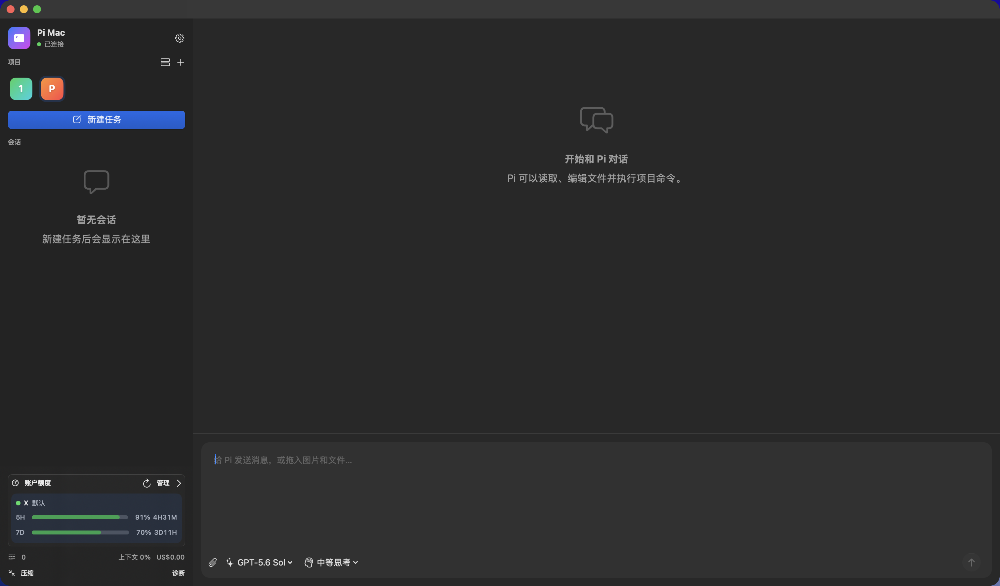

# Pi Mac

[English](README.md) | **简体中文**

[](https://github.com/TianYa-Q/PiMac/actions/workflows/release.yml)
[](https://github.com/TianYa-Q/PiMac/releases/latest)
[](https://github.com/TianYa-Q/PiMac)
[](LICENSE)

一个使用 SwiftUI 构建的原生 macOS [Pi coding agent](https://github.com/earendil-works/pi) 客户端。桌面、iOS 与 Telegram 统一使用官方 T3 Server orchestrator V2 和内置 Pi Provider，不再使用自研 Pi Adapter。

> **源码架构更新：**已迁移至官方 main 的 Pi Provider 和 orchestration protocol 2。支持原生扩展对话、/compact 和 steering；旧私有账户状态、Fast/独立压缩模型和工具富输出不再提供。下方发行版说明不代表当前源码功能对等；真实历史升级和手机验收仍待完成。以[当前架构与限制](docs/t3-server-migration.md)为准。



## 功能特性

- 在同一窗口添加和切换多个项目，分别保留会话与后台任务
- 当前源码新增原生 T3 Git 面板：查看分支、工作区变更和差异，选定文件提交、推送、创建 PR 与拉取；支持记忆宽度的可调整侧栏；Server 状态位于 Pi Mac 右侧，Git 位于压缩按钮右侧，不额外占用会话顶部空间。详见 [Git 集成说明](docs/t3-code-integration.md#git--vcs)。
- 流式显示回答、思考过程和工具调用
- 兼容 Pi 1.0 Code Mode：显示 JavaScript 脚本、嵌套调用和工具图片输出，保留已有 Pi 工具与 MCP 配置
- 发送消息、重新编辑历史提问、在工具调用后插入指令、任务完成后继续消息，以及删除尚未消费的排队消息
- 拖放、选择或粘贴图片与文件，并通过 RPC 发送图片内容
- 切换模型与思考等级
- 在设置中检查 Pi 与扩展包版本，并一键更新可用的新版本
- 切换空闲会话时（包括跨项目）尽量复用 Pi RPC 进程；任务并行时使用独立进程，离开空闲会话时停止其进程，会话历史继续保存在本地
- 新建、命名和打开持久化会话；重启时若当前项目在最近 30 分钟内有用户消息或助手文字回复，就打开最近活跃的会话，否则新建会话；切换项目时若上次选中的会话在最近 30 分钟内有交互，就继续打开，否则新建会话
- 用量面板统计助手响应、工具内部模型调用、压缩/分支摘要及独立用量记录，自动重建旧版统计缓存；嵌套工具调用在父工具下展示，并从会话元数据恢复
- RPC 正确处理输入接管（`handled`）；状态查询超时可诊断，停止/重启会取消未完成请求，写入不阻塞界面
- 查看上下文压缩、Token、费用和上下文占用统计；显示当前任务输出速度（tokens/s，按模型实际用量计算，含思考和首字等待、不含工具耗时；提供商不返回流式用量时在响应结束更新）
- OpenAI Responses / Codex 模型支持 Fast 开关（优先处理，可能消耗更多额度，不改变思考等级）；偏好跨重启保留，桌面与 Telegram 共用，不修改全局 Pi 配置
- 支持 Pi 扩展提供的选择、确认、输入和编辑对话框
- 内置维护的 [account-usage](extensions/account-usage/README.md) 支持 OpenAI ChatGPT / Codex 多账户与 Gemini 额度；凭据、默认账户和额度按 provider 隔离，API Key 不会被自动覆盖
- 自动切换与周额度负载平衡由 `account-usage` Pi 扩展执行，不依赖 PiMac UI。托管 OAuth 账户的 5h 剩余额度低于 5%（或周额度不高于 5%）时，在安全边界切换到可用账户；按周剩余额度与距离重置的天数分配消耗，采用 1.5 倍差距与 10 分钟冷却防抖。跳过隐藏、过期、额度未知或报错的候选；不替换未托管 API key。自动切换只更新当前会话绑定，不改其他会话或新会话默认账户。执行中等待工具完成后的 turn 边界，不中断请求、不重放提示；已确认额度错误且切换成功时最多自动续跑一次，取消、其他错误或切换失败不续跑。无可用账户保持不变。详见 [扩展说明](extensions/account-usage/README.md)。
- 直接复用 `~/.pi/agent` 中已有的登录、模型、Skills、扩展与配置

## 插电合盖运行（当前源码）

在 **设置 → 运行环境 → 插电合盖运行** 开启。需要管理员授权，无需外接显示器，不安装常驻服务。成功开启后会记住开关，下次启动软件自动尝试开启（未配置免密码权限时可能再次请求管理员授权）；手动关闭后不再自动开启，也可单独取消“启动软件时自动开启”。守护进程每 2 秒检查电源：插电时禁用系统休眠，拔电、关闭开关或应用退出时恢复；应用异常退出通过心跳超时恢复（约 10 秒）。插电且合盖时，每 2 秒检测一次盖子状态并用 `pmset displaysleepnow` 请求屏幕休眠，电脑继续运行；此命令会同时熄灭外接显示器。开盖后停止发送熄屏请求，可通过键盘或触控板唤醒屏幕。不修改屏幕或电池的休眠时间。

### 一次授权，以后免密码开启

如果系统已有相同的免密码权限（例如 Amphetamine 安装的规则），Pi Mac 会自动识别并复用，直接开启即可，不再重复安装。Pi Mac 不会移除其他软件安装的规则。

没有现有权限时，先关闭合盖运行，再点击设置中的 **“一次授权，以后免密码开启”**，输入一次管理员密码。配置成功后会自动开启并记住启动偏好，以后无需重复输入密码。需要恢复原样时，点击 **“移除免密码权限”**（移除仍需管理员授权）。

此简化方案不安装系统服务，不保存密码，只在 `/private/etc/sudoers.d/pimac-lid-sleep-<当前用户名>` 安装一条经过 `visudo` 校验的规则：允许当前账户免密码执行 `/usr/bin/pmset -a disablesleep 0` 和 `/usr/bin/pmset -a disablesleep 1`，不允许任意 root 命令。守护进程以普通用户运行，只有切换休眠开关时使用 `sudo -n`。注意，该账户下其他程序也能使用这两项权限；删除应用不会自动删除此规则，请先在设置中移除。若系统没有启用 sudoers.d，会拒绝安装，不修改主 sudoers 文件。

开启、授权和命令失败的诊断日志保存在 `~/Library/Logs/PiMac/lid-sleep.log`，不记录密码。

此功能使用 macOS 的全局 `pmset disablesleep` 开关，而不是模拟显示器；插电启用期间也会阻止手动休眠。请保持通风，勿放入包中，也不要同时运行其他防休眠工具。若系统原本已禁用休眠，会拒绝接管。该非公开设置的合盖效果仍需在目标 Mac/macOS 上实机验证。

如果守护进程被强制杀死或恢复失败，可在终端手动恢复：`sudo pmset -a disablesleep 0`。自动开启只在每次启动时尝试一次，取消授权或失败后不会反复弹窗；首次未开启时默认不自动启用。

## 下载与安装

1. 从 [GitHub Releases](https://github.com/TianYa-Q/PiMac/releases/latest) 下载最新的 `Pi-Mac-vX.Y.Z.zip`。
2. 解压后，将 **Pi Mac.app** 移入“应用程序”目录。
3. 确保已经安装并登录 Pi。
4. 如需账户管理与额度显示，从本项目安装统一维护的 `account-usage`（新版 OpenAI 需要 Pi 0.99.1+）：

   ```bash
   npm --prefix extensions/account-usage ci --ignore-scripts
   ./scripts/link-account-usage.sh
   ```

   已安装旧版时请先备份/移除旧安装，避免重复加载。选中 `openai` 模型后用 `/accounts` 登录 ChatGPT；legacy Codex token 不会自动迁移。账户数据仍在 `~/.pi/agent/`，不写入项目。更新后重启 Pi / 重新连接会话；完整验证运行 `./scripts/check.sh`。

> 当前 Release 使用 ad-hoc 签名，尚未经过 Apple 公证。macOS 首次拦截时，请在 Finder 中右键应用并选择“打开”，或前往“系统设置 → 隐私与安全性”确认打开。

## 环境要求

- macOS 14 或更高版本
- 已安装并登录 [Pi coding agent](https://github.com/earendil-works/pi/tree/main/packages/coding-agent)，当前兼容性测试版本为 **1.0.0**
- Node.js 24+（内置 T3 Server 的运行要求）

Pi Mac 默认依次查找：

1. `~/Library/pnpm/bin/pi`
2. `/opt/homebrew/bin/pi`
3. `/usr/local/bin/pi`

你也可以在应用设置中指定其他路径。应用通过登录 Shell 启动 Pi，因此在 GUI 环境中仍可读取 Node 和 pnpm 的路径。项目列表及最后使用的项目保存在 macOS `UserDefaults` 中，对话则由 Pi 持久化到 `~/.pi/agent/sessions/`。

## Code Mode

在 `~/.pi/agent/settings.json` 中启用官方工具，与现有工具共存：

```json
{"defaultTools": ["+codemode"], "codemode": {"mode": "on"}}
```

请合并字段，不要覆盖整个配置或已有的自定义工具列表。从源码目录执行
`node scripts/enable-codemode.mjs` 会保留工具选择，并备份原配置。
配置更改后重新连接空闲会话；受信任项目的配置仍可覆盖全局选择。
详见 [Pi 1.0 兼容说明](docs/pi-1.0-compatibility.md)。

## Telegram 远程控制

1. 在 Telegram 中通过官方 `@BotFather` 创建专属 Bot，复制 Token。
2. 在 Pi Mac 的「设置 → Telegram 远程控制」填写 Token 和你自己的 Telegram **数字用户 ID**（不是用户名），勾选启用并点击「保存并应用」。设置页区分实时连接状态与待应用修改，保存成功不代表 Bot 已连接。更换已有凭据或停用时会先确认再清空等待任务；更换凭据还会清除未送达消息与原消息的会话关联，停用则保留未送达消息供重新启用后重试。Token 以明文保存在本机应用设置（`UserDefaults`）中，不会触发钥匙串授权。旧版钥匙串 Token 不会自动读取或删除，升级后请重新填写；如需清理旧凭据，可在「钥匙串访问」中手动删除 `PiMac.Telegram`。
3. 与 Bot 私聊，输入 `/` 即可看到已注册的命令补全（连接成功后生效）；也可发送 `/help` 或点击消息下方按钮。用 `/projects` 下方的按钮切换 Telegram 专用项目，确认 `/status` 就绪后直接发送文本、照片或不超过 20 MB 的文件（可附说明文字）执行任务，完成后自动回传文本回复。文件会临时保存在 Mac 并以本地附件路径交给 Pi；图片分析请发送照片。若回复中通过 Markdown 文件链接（如 `[下载报告](report.pdf)`）明确引用本次任务新建或修改的项目文件，Bot 会自动将其作为附件发回（每次最多 3 个，每个不超过 20 MB）；不会向 Pi 的任务上下文注入额外指令，文件发送失败会在后台重试。项目列表只显示项目名称；项目较多时可点击「下一页」查看其余项目。

`/status` 或“状态”按钮直接刷新当前会话状态；其他项目有执行或排队任务、待确认、回传中、未送达结果或连接失败时，会附加分页总览（含桌面与 Telegram 任务），不显示正常空闲项目，也不会为查看状态启动它们。任务状态卡与手动查看使用同一格式，没有额外的“刷新”按钮。Bot 文案针对手机采用短标题、统一字段和精简提示；名称与摘要限制长度，减少重复说明，保留有辨识度的图标。成功的 AI 回复保持原文，失败与部分回复单独标注。选择项目后显示该会话的当前 Codex 账户、模型、推理强度和上下文占比（尚无统计时显示“待统计”）；使用 `/model` 和 `/thinking` 下方按钮分别选择模型和推理强度；模型选择后直接显示最新状态。桌面与 Telegram 共用模型、推理强度和 Fast 偏好；同一历史会话复用同一个任务运行实例，Telegram 路由不会改变桌面当前选中项。仅在会话空闲且就绪时可更改。

使用 `/sessions` 查看当前 Telegram 项目保存在 Pi 本机的历史会话（包含以前创建的会话），点击按钮即可切换后续消息的目标；也可以用 `/new` 新建会话。直接回复之前的任务消息、确认消息、状态卡片或 Bot 回复，仅将本条消息发送到那条消息对应的项目和会话，不改变当前选择；后续不带引用的文本、图片和文件仍发往之前选中的项目和会话。只有通过 `/projects` 或 `/sessions` 显式选择才切换默认目标。这种关联在应用重启后依然有效。列表支持分页；切换前须等待当前任务和排队消息完成，不能切换到其他项目的会话。旧按钮失效时重新发送 `/sessions`。Telegram 的选择不会改变桌面当前选中的会话。

Telegram 局部引用回复会把选中的文字与回复正文一起传给模型；图片和文件的说明文字也支持局部引用，原会话路由保持不变。

尚未执行的排队任务支持编辑同步：编辑原消息文本或附件说明，会更新排队内容，保持原项目、会话和队列位置；能找到原排队确认卡片时，直接更新该卡片，减少重复确认消息。排队确认消息下的「取消此排队任务」按钮可单独移除该任务，不影响正在执行的任务和其他排队消息。可用 `/queue` 或「队列」按钮集中查看当前默认会话的 TG 等待任务，每页 5 条，展示内容摘要、附件数和等待时长；取消按钮按任务 ID 操作，取消后更新列表，已开始或过期的任务不会被停止。查看队列不会启动或切换会话；Pi 内部排队消息单独显示数量，须在 Mac 上管理。普通私聊删除原消息不会取消任务，请使用取消按钮；已开始执行的任务不能编辑同步，替换附件须先取消再重新发送。

其他命令：`/usage` 统一查看 account-usage 扩展同步的 Codex/Gemini 剩余额度及切换账户（使用最近一次缓存，不主动刷新）。旧 `/accounts` 仅兼容已发送的命令和卡片，不再出现在菜单或帮助中，后续翻页统一使用 `/usage`；Codex 账户每页 4 个，以单行展示剩余百分比与刷新倒计时，附低额度提示和缓存年龄，缓存超过 15 分钟时提醒数据可能已变化，Gemini 额度放在第 1 页。“查看最新缓存”只读取本地快照，不主动请求刷新；状态卡在上下文占用达到 85% 时提醒，并突出需要在 Mac 上处理的扩展确认，点击额度消息下方的账户按钮可切换 Telegram 会话的 Codex 账户（对两端打开的同一会话生效，空闲且就绪时可切换）、`/new` 新建会话并直接返回状态、`/compact` 在会话空闲且无排队任务时压缩上下文、`/stop` 停止当前任务并取消等待队列。任务回复或命令确认消息发送失败时会在后台自动重试；未送达消息会保存在本机，重启后继续重试，切换 Bot Token 或允许的用户 ID 时清除。Telegram 的项目选择和各项目会话与桌面选择独立：切换项目不会切换 Mac 界面，也不会向桌面当前会话发送任务；重新启动后恢复 Telegram 自己的项目及会话。最近选择的两个项目保持连接，方便快速来回切换；冷启动切换会先快速返回，Pi 就绪后自动更新状态卡片。已经提交的任务回复仍来自原会话。忙碌或会话尚未就绪时新消息会进入内存中的等待队列；未就绪时后台每 5 秒尝试恢复 Pi 连接，就绪后按顺序执行并自动回传，无需重发。任务提交后，Bot 立即发送带导航按钮、排队数量和执行计时的会话状态卡片，后续约每 30 秒更新计时。项目和模型列表每页显示 8 项，均使用整行按钮，减少长名称截断和误触。导航使用辨识图标与简短文字，停止操作单独占一行，明确提示会同时取消排队。项目、模型和账户按钮使用稳定标识，列表重排不会改变按钮对应的选项；选项已移除、标识重复或旧版序号按钮失效时，须重新打开列表。切换模型及推理强度后短暂等待实际设置更新，区分“已切换”和“尚未确认生效”；模型、推理强度和账户统一要求会话空闲、就绪且无排队任务。底部操作随页面与任务状态变化，执行中显示“停止当前任务并取消排队”，空闲会话页显示“新会话”和“压缩”。修改会话的按钮绑定发送卡片时的目标；默认会话已经切换、卡片来自上次运行或重试送达时，Bot 会拒绝操作，不会误操作其他会话。请重新查看“状态”或打开对应列表获取新按钮；导航和单条排队取消不受影响。任务确认消息展示目标、简短任务预览、附件数和排队位置，等待本机扩展确认时会明确提醒。可在同一卡片中切换项目、会话、模型、额度等页面；同一卡片的编辑按顺序发送，切换页面会使排队中的旧计时刷新失效，避免网络中的计时更新落在新页面之后。排队确认卡片在任务提交、取消或提交失败时移除取消按钮；短任务在初始状态卡发送期间结束，也会显示固定耗时和最新结果送达情况。切回正在执行任务的会话状态后，计时会从原始开始时间继续。结束后回传结果，并只更新仍在显示该任务状态的卡片。结束摘要区分完成、停止、失败和无文本回复，执行耗时在回传前冻结，单独显示结果送达情况与剩余排队任务；停止或失败前的输出会标为部分回复。已完成的空闲卡片改为“新会话 / 压缩”，非当前会话的任务卡只保留导航，不显示修改会话按钮。可用 `/stop` 清空当前会话队列；软件退出会清空未执行的队列。扩展确认对话框仍需在 Mac 上处理。

- 默认关闭，仅接受配置用户的私聊，忽略群聊、其他用户和首次连接启动前的旧消息；首次成功轮询后保存处理位置，后续重启会接收离线期间的消息。更换 Bot Token 或允许的用户 ID 后重新从首次连接开始。已接手的消息不会因发送确认失败而重复执行；若恰好在记录处理位置后、执行前崩溃，该条消息可能未执行。
- Mac 必须保持唤醒、联网并运行 Pi Mac；使用 Telegram 长轮询，不需要开放入站端口。同一个 Bot 不应被其他程序轮询，也不能配置 Webhook。
- 远程任务拥有本机 Pi 的文件访问及命令执行权限，任务与回复会经过 Telegram（Bot 私聊不是端到端加密）。未送达回复和命令确认消息会以明文保存在本机应用设置中。请保护好 Telegram 账户及 Token，不要使用共享 Bot。
- 长回复按 Telegram 已确认送达的分段保存进度，失败或重启后续传剩余分段。网络故障按 5 秒至 5 分钟指数退避，限流遵循 Telegram 的 `retry_after`；永久 API 错误暂停投递并保留结果。修正配置后可在设置点击「重新连接」，不清空运行任务或等待队列。卡片仅在 Telegram 明确表示原消息不存在或不可编辑时新建；临时失败重试原卡片，导航后过期重试失效。Telegram 没有发送幂等键，若发送成功但确认响应丢失，仍可能重复该分段。关闭开关并保存即可停止控制，清空 Token 后保存可删除本地设置中的 Token（不会删除旧版钥匙串条目）。

## T3 Code iOS

**设置 → T3 iOS 连接** 仅提供官方 T3 Connect 托管 Cloudflare Tunnel，直接使用 App Store 版 T3 iOS。Mac 与手机登录同一账号；在手机删除旧的 **Pi Mac · LAN** 条目，再开启 **Pi Mac · Tunnel**。已移除 LAN 监听、IP/端口设置和配对码/二维码；升级会清除旧 LAN 访问偏好。本机 Server 和管理接口仍仅监听 loopback。

桌面、手机与 Telegram 共用官方 Server 的项目、线程和任务。远程操作具有本机 Pi 的执行权限；正文和附件经过 Cloudflare，并非端到端加密。暂停上报不会关闭 Tunnel，退出绑定才撤销隧道。设置提供有界、脱敏的连接诊断。协议测试覆盖 HTTPS/TLS 终止与 WebSocket 授权，App Store、Apple 登录和推送仍须实机验收。详见[连接步骤、限制和恢复说明](docs/t3-code-integration.md)。已有任务结束后再重启新构建。

## 本地开发

需要 Swift 5.10 或更高版本。克隆仓库后运行：

```bash
git clone https://github.com/TianYa-Q/PiMac.git
cd PiMac
./scripts/prepare-t3-server.sh
swift run PiMac
```

开发时可改用 `python3 scripts/dev.py`：监听源码变化并合并待更新，等桌面及 Telegram 会话全部空闲、没有排队消息或扩展确认后才构建；成功后再次确认空闲，再自动重启 Pi Mac。构建期间又有修改时，会推迟重启，等待最新源码构建成功。构建失败不会重启；脚本退出时（包括 Ctrl-C、SIGTERM）会清理本项目的 Pi Mac 实例、T3 Server 及子服务，包括热重启后的应用；短暂等待后仍未退出的进程会被强制结束，因此运行中的任务会中断。脚本拒绝启动第二个监听器；若存在旧应用，会在退出时清理，再次执行脚本即可。普通运行与打包应用不会自动重启。

开发监听器会构建并运行 `.build/Pi Mac Dev.app`，支持使用应用图标的原生通知；首次启动请允许系统通知。开发版使用独立的应用 ID（`com.jianfeng.pi-mac.dev`），通知权限和偏好设置与正式版分开；前台和后台任务结束都会提醒，使用系统默认声音。`swift run` 的裸可执行文件不支持系统通知。

重启由监听器统一管理：应用先等待旧服务和服务锁释放，再提交重启请求并退出；监听器回收旧应用后才启动新版，并在 30 秒内检查新版心跳，不再使用无限等待 PID 的 shell。退出交接和启动检查超时会明确报错，不会启动第二个应用实例。升级这套监听器后，需要先 Ctrl-C 停止旧监听器，再重新运行 `python3 scripts/dev.py`。

监听器默认只输出带时间的构建、文件变更和重载状态。完整输出保存在 `.build/dev-build.log`（最近一次构建）、`.build/dev-app.log`（追加保存应用启动、停服与重启阶段）及 `.build/dev-watch.log`（追加保存监听器生命周期）；构建失败时还会显示最后 40 行。使用 `python3 scripts/dev.py --verbose` 可在终端显示构建详情及实时应用日志。

安装完整 Xcode 后，也可以直接打开 `Package.swift`。

### 检查与测试

项目使用 Swift 工具链自带的 `swift format`，无需额外安装 SwiftLint：

```bash
./scripts/lint.sh
swift build
swift test
```

### 打包应用

```bash
APP_VERSION=0.1.0 BUILD_NUMBER=1 ./scripts/package-app.sh
open "dist/Pi Mac.app"
```

脚本默认生成 ad-hoc 签名的 `dist/Pi Mac.app`。Telegram Token 保存在本机应用设置中，重新打包不会触发钥匙串授权。如需使用固定的代码签名证书，可设置：

```bash
CODE_SIGN_IDENTITY="证书名称或 SHA-1" ./scripts/package-app.sh
```

公开分发若需避免 Gatekeeper 提示，应使用 Apple Developer 证书签名并完成公证。

## 发布新版本

推送符合 `vX.Y.Z` 格式的标签后，[Release workflow](.github/workflows/release.yml) 会自动运行测试、构建应用、生成 ZIP 和 SHA-256 校验文件，并创建 GitHub Release：

```bash
git tag v0.1.0
git push origin v0.1.0
```

也可以在 GitHub 的 **Actions → Release → Run workflow** 中输入版本标签手动发布。

## License

[MIT](LICENSE)
